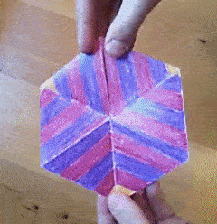

Title: Advanced Squeezes from the club, Part 2	
Date: 2020-02-26 17:00
Category: Advanced
Tags: Declarer Play, Squeeze 

My follow up to part 1 took longer than I anticipated, but I'm glad it did. I'm going to write about a different hand, one which came up yesterday.

In geometry, there is a family of shapes known as a *flexagon*, a shape which can turn itself "inside out", so to speak. Today's hand reminds me of that type of contortion, so I am dubbing this a Flexagon Squeeze.

<figure>
  
  <figcaption> A flexagon, courtesy of Wikipedia (public domain)</figcaption>
</figure>

---

North is dealer. South opens 1\h in 3rd seat, North responds 1\s, South bids 1NT which ends the auction. The auction isn't the focus, but it is worth noting; with 25 HCP it seems like game is inevitable, but as it happens not one pair reached game. 15 counts with honor singletons are always awkward, this is no exception. The point of the hand remains the same in 3NT as in 1NT, so for our purpose today it doesn't matter.

Suppose you get a 4th best \d3 lead, \d2, \d10, \dJ. Next you lead \sQ, won by East. The \d9 is returned. Plan the play from here.

---
Let's look at the whole hand.

Assuming that spades divide, we have 10 tricks: 4 spades, 2 hearts, 2 diamonds, 2 clubs. We've lost one trick, however we have the option of ducking the \d9 to "rectify the count". That is, reduce ourselves to an ending where we have all but one of the remaining tricks. Prime ingredients for a squeeze.

At the table West thought long and hard, but allowed East to hold the \d9. East returned a heart around to the blank \hK. There are many possible roads to success from here, but the easiest is to take your side suit winners quickly. In that light, I played a diamond to the \dA, cashed the \hA (pitching a club) and crossed back to dummy to with the \cK to run spades. 

North leads their last spade. East must choose between discarding the \hQ (allowing the \h10 to be good) or discarding a club. They chose the club. The \h10 has served its purpose and is now discarded. It is West's turn to feel the vice: they cannot discard the \dK or dummy's \d7 is a winner. So they too discard a club. A club to the \cA drops the \cQ and \cJ in turn, leaving the \c8 as a winner for trick 13. A double squeeze.

What is particularly interesting about this squeeze is its lack of fragility. Many squeezes can be disrupted by the defense by leading key suits, destroying communications. It would seem on the surface that at the point East returned a heart that a club would break up this squeeze since we used clubs to get back and forth. While that is true, this squeeze can be turned on its head! Consider the following sequence: we fly on the \cA, keeping the \cK on the board. (Essential.) This does mean we can no longer operate the squeeze as we did before, but we can flip the order of play and execute a non-simultaneous variety of double squeeze instead.

We cross to the \hK and run the spades, discarding 2 clubs and 2 hearts from hand. 

The position on the last spade doesn't put anyone under pressure quite yet, as both East and West can safely discard a heart. (This is the trick we are discarding our second club from hand.)

We now cross back to the \dA and East must discard. They are *now* squeezed; if they discard a heart, we have 2 heart winners in hand. So they throw a club.  Now in hand, we lead the \hA and West gets to squirm. If they discard the \dK, we throw dummy's losing club. If they pitch a club we discard the \d7 and once again the \cQJ crash under our high honor, leaving us with a 3rd winner in the club suit. This is again a "non-simultaneous" variety of double squeeze like we saw in the first article.

Double squeezes aren't extremely common, but they aren't all that rare either. This "flexagon" version where you can squeeze each opponent in either order is quite unusual, requiring a lot of flexibility in the communications to accomplish.

[Try this hand yourself!](http://www.bridgebase.com/tools/handviewer.html?n=skjt83hkd7642ckt3&s=sqhat865daj5ca874&w=s9762h32dkq83cj65&a=pp1hp1sp1ntppp&p=d3d2dtdjsqs2s3sad9)  Thanks to BBO for providing these tools to help explore hands.